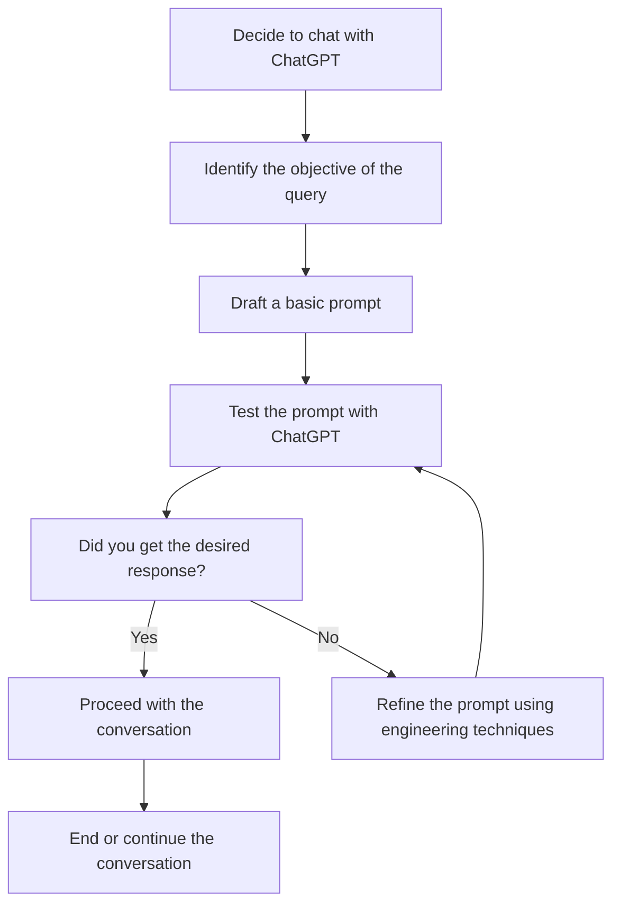

# How to Prompt Engineering
by: `Ashry Ramadhan` <br>
created: 10/10/2023

## Table of Contents
- [1. Prompting Principles](#1-prompting-principles)
- [2. Wrapper](#2-wrapper)
- [3. Formatting Output](#3-formatting-output)
- [4. Give the Model Prior Knowledge](#4-give-the-model-prior-knowledge)
- [5. Give the Model N Instructions](#5-give-the-model-n-instructions)
- [6. Compare and Evaluate Prior Solutions with Model Solutions](#6-compare-and-evaluate-prior-solutions-with-model-solutions)
- [7. Input-Output Pair Solution](#7-input-output-pair-solution)
- [8. Sentiment Analysis](#8-sentiment-analysis)
- [9. Extracting or Identifying Information from The Provided Data](#9-extracting-or-identifying-information-from-the-provided-data)
- [10. Generative Mode by Few-Shot Prompting](#10-generative-mode-by-few-shot-prompting)
    - [10.1. Generate a marketing product description from a product fact sheet](#101-generate-a-marketing-product-description-from-a-product-fact-sheet)
    - [10.2. Add Focus To Your Instructions](#102-add-focus-to-your-instructions)
    - [10.3. Generate Table for The Response](#104-generate-table-for-the-response)
- [11. Focus on Importance Words](#11-focus-on-importance-words)
- [12. Role Playing Chat Bot](#12-role-playing-chat-bot)
- [13. Conditional Instruction](#13-conditional-instruction)
- [14. Transforming](#14-transforming)
- [15. Simulating a Mini Program](#15-simulating-a-mini-program)

---


> fun fact: above diagram was generated by ChatGPT :D

---

### 1. Prompting Principles
- Principle 1: **write clear and specific instructions**
- Principle 2: **Give the model time to "Think"**

### 2. Wrapper
Use delimiters to clearly indicate `distinct` parts of the input. Delimiters:
- \```content\```
- """contents"""
- \<content\>
- : contents

#### 2.1. Implementations
look at below example, these words `delimited`, `triple backticks`, and `into a single sentence` are crucial.

````markdown
Summarize the text delimited with triple backticks into a single sentence.

```text
your paragraph is here.
```
````
---
another example, with keywords: `provided`, `delimited`, `triple backticks`, and `Information:`

````markdown
You will be provided with Information delimited by triple backticks.

Information:
```
your information is here.
```
````

### 3. Formatting Output
You can formatting your output in some ways, such:
- JSON
- XML
- CSV
- Python List
- Python Dict
- etc.

#### 3.1. Implementations
keywords: `Generate`, `a list of three`, `Provide`, `JSON`, `following keys`

```
Generate a list of three made-up book titles along with their author and generes. Provide them in JSON format with the following keys: book_id, title, author, genere.
```
output >>:
```JSON
[
    {"book_id": 1, "title": "The Enigma of Eternity", "author": "Eleanor Hartfield", "genre": "Mystery"},
    {"book_id": 2, "title": "Echoes of Destiny", "author": "Jonathan Silverwood", "genre": "Fantasy"},
    {"book_id": 3, "title": "Whispers in the Shadows", "author": "Amelia Sinclair", "genre": "Thriller"},
]
```
---
keywords: `if`, `contains`, `re-write`, `following format`, `then` <br>
this time the example is preety unique, because we use `conditional checking` word such `if-else` or `if-then`.

````markdown
You will be provided with text delimited by triple quotes.

If it contains a sequence of instructions, re-write those instructions in the following format:

Step 1 - ...
Step 2 - ...
...
Step N - ...

If the texts does not contain a sequence of instructions, then simply write "No steps provided"

```
Making a cup of tea is easy!. First, you need to get some water boiling. While that's happening, grab a cup and put a tea bag in it. Once the water is hot enough, just pour it over the tea bag. Let it sit for a bit so the tea can steep. After a few minutes, take out the tea bag, If you like, you can add some sugar or milk to tast. And that's it!. You've got yourself a delicious cup of tea to enjoy.
```
````
output >>:
* Step 1 - Get some water boiling.
* Step 2 - While the water is boiling, grab a cup and put a teae bag in it. <br>
...
* Step N - ...

### 4. Give the Model Prior Knowledge
this method also called `One-Shot` or `Few-Shot Prompting` it depends on how many examples/prior knowledges you provide to the model, since we provide some prior knowledge to the model, so the model can give more correlated respond.

#### 4.1. Implementations
keywords: `consistent style`
````markdown
Your task is to answer in a consistent style.

<child>: Teach me about patience

<grandparent>: The river that carves the deepest valley flows from a modest spring; the grandest symphony originates from a single note; the most intricate tapestry begins with a solitary thread.

<child>: Teach me about resilience.

````
---
above example is few-shot prompting, what is the difference between `zero-shot` and `few-shot` prompting?

> Zero-shot prompting entails `relying` solely on an LLM’s `pre-trained information` to answer a given user prompt.

here the example of zero-shot prompting:
```
Determine the sentiment of this sentence.
Sentence: 'This basketball has a lot of weight'.
```

### 5. Give the Model N Instructions
Actually, we can give the model `n` instructions as long as the instructions are clear enough to be executed by the LLM.
This method will give the model time to `think`.

### 5.1. Implementations
Keywords: `following`, `Separate`

````markdown
Perform the following actions:
1 - Summarize the following text delimited by triple backtics with 1 sentence.
2 - Translate the summary into French.
3 - List each name in the French summary.
4 - Output a json object that contains the following keys: french_summary, num_names.

Separate your answers with line breaks.

Text:
```
In a charming village, siblings Jack and Jill ...
```
````
---
Keywords: `Following`, `format`

````markdown
Your task is to perform the following task:
1 - Summarize the following text delimited by <> with 1 sentence.
2 - Translate the summary into French.
3 - List each name in the French summary.
4 - Output a JSON object that contains the following keys: french_summary, num_names.

User the following formats:
Text: <text to summarize>
Summary: <summary>
Translation: <summary translation>
Names: <list of names in Italian summary>
Output JSON: <json with summary and num_names>

Text:
<
In a charming village, siblings Jack and Jill ...
>
````

### 6. Compare and Evaluate Prior Solutions with Model Solutions
Instruct the model to `work` out its own solution before rushing to a `conclusion`. Actually, we made the model comparing our solution with its solution, then check which one is more `correct` or `efficient` (better).

#### 6.1. Implementations
Keywords: `Determine`, `if`, `is correct or not`, `compare`, `evaluate`, `Don't decide`, `untill`

````markdown
Your task is to determine if the student's solution is correct or not.

To solve the problem do the following:
1. First, work out your own solution to the problem.
2. Then, compare your solution to the student's solution and evaluate if the students's solution is correct or not.

Don't decide if the student's solution is correct untill you have done the problem yourself.

Use the following format:
- Question: <question here>
- Student's solution: <student's solution here>
- Actual solution: <steps to work out the solution and your solution here>
- Is the student's solution the same as actual solution just calculated: yes or no
- Student grade: correct or incorrect

```
Question:
I'm building a solar power installation and I need help working out the financials.

- Land cost $100 / square foot
- I can buy soal panels for $250 / square foot
- I negotiated a contract for maintenance that will const me a flat $100k per year, and an additional $10 / square foot

What is the total cost for the first year of operations as a function of the number of square feet.

Student's Solution:
Let x be the size of the installation in square feet.

Const:
1. Land cost: 100x
2. Solar panel cost: 250x
3. Maintenance cost: 100,000 + 100x
Total cost: 100x + 250x + 100,000 + 100x = 450x + 100,000
```
````

### 7. Input-Output Pair Solution
If you only have the input-output pair without the process or solutions. Then, we can ask the model to find the solutions based on the input-output pair (`patterns`). This method similiar to `Few-Shot Prompting` because we are providing the prior knowledge to the model to answer our questions.

#### 7.1. Implementations
````markdown
Your will be provided with a task delimited by triple quotes.

Perform the following actions:
1 - Solve the task based on the input and output pairs given into python function code.
2 - Analyze the time complexity of your solution
3 - Tell me if your solution is correct by cross-checking with the given outputs from task number 1.

If the task doesn't possible for you to be solved, then simply write "Cannot be solved!"

Don't decide if your solution is correct untill you have done the problem yourself and cross-checking with the actual output.

Use the following formats:
Task: <task to solve>
Solution: <the solution>
Time Complexity Analysis: <time complexity analysis of your solution>

```
1. Input: [[2], [3]] -> Output: [5]
2. Input: [[1, 2], [1, 9]] -> Output: [3, 1]
3. Input: [[3], [1, 2]] -> Output: [1, 5]
4. Input: [[1, 0, 3], [2, 2]] -> Output: [1, 2, 5]
```
````

### 8. Sentiment Analysis
The GPT model can be used to sentiment analysis, and can solve few tasks such:
- Identify types of `emotions`
- Identify `anger`

#### 8.1. Implementations

Keywords: `sentiment`
````markdown
What is the sentiment of the following product review, which is delimited with triple backticks?

Product Review:
```
The product review ...
```
````
---
Keywords: `Identify`, `a list of`, `emotions`
````markdown
Identify a list of emotions that writer of the following review is expressing. 

Include no more than five items in the list.

Format your answer as a list of lower-case words separated by commas.

Review text:
```
The review ...
```
````
---
Keywords: `expressing`, `anger`
````markdown
Is the writer of the following review expressing anger?
The review is delimited with triple backticks.

Give your answer as either yes or no.

Review text:
```
The review ...
```
````

### 9. Extracting or Identifying Information from The Provided Data
We can extract the only information we need from the provided data.


#### 9.1. Implementations

Keywords: `Identify`
````
Identify the following items from the review text:
- Item purchased by reviewer
- Company that made the item

The review is delimited with triple backticks.

Format your response as a JSON object with "Item" and "Brand" as the keys.

If the information isn't present, use "unknown" as the value.

Make your response as short as possible.

Review text:
```
The review ...
```
````
---
Keywords: `Determine`
````
Determine whether each item in the following list of topics is a topic in the text below, which is delimited with triple backticks.

Give your answer as list with 0 or 1 for each topic.

List of topics: "nasa", "local goverment", "engineering", "employee satisfaction", "federal goverment"

Text Sample:
```
In a recent survey conducted by ...

One Nasa employee, John Smith, commented on the findings ...

The results were also welcommed by NASA's management team ...

Social Security Administration had the ...
```
````
Output >>:
```markdown
the list of topics and their corresponding presence in the text sample are as follows:

* "nasa" - 1 (present in the text)
* "local goverment" - 0 (not present in the text)
* "engineering" - 0 (not present in the text)
* "employee satisfaction" - 1 (indirectly mentioned as "satisfaction rating" in the text)
* "federal goverment" - 1 (mentioned as "goverment" in the text)

Therefore, the answer is [1, 0, 0, 1, 1]
```

### 10. Generative Mode by Few-Shot Prompting
We can generate any words, sentences, or paragraphs with any formats we want based on the information we provide to the model. (using few-shot prompting)

#### 10.1. Generate a marketing product description from a product fact sheet

Keywords: `to help`, `create a description`, `based on`
````markdown
Your task is to help a marketing team to create a description for a retail website of a product based on a technical fact sheet.

Write a product description based on the information provided in the technical specifications delimited by triple backticks.

Use at most 50 words.

Technical Specifications:
```
OVERVIEW
- Part of a beautiful family of mid-century inspired office furniture, 
including filing cabinets, desks, bookcases, meeting tables, and more.
- Several options of shell color and base finishes.
- Available with plastic back and front upholstery (SWC-100) 
or full upholstery (SWC-110) in 10 fabric and 6 leather options.
- Base finish options are: stainless steel, matte black, 
gloss white, or chrome.
- Chair is available with or without armrests.
- Suitable for home or business settings.
- Qualified for contract use.

CONSTRUCTION
- 5-wheel plastic coated aluminum base.
- Pneumatic chair adjust for easy raise/lower action.

DIMENSIONS
- WIDTH 53 CM | 20.87”
- DEPTH 51 CM | 20.08”
- HEIGHT 80 CM | 31.50”
- SEAT HEIGHT 44 CM | 17.32”
- SEAT DEPTH 41 CM | 16.14”

OPTIONS
- Soft or hard-floor caster options.
- Two choices of seat foam densities: 
 medium (1.8 lb/ft3) or high (2.8 lb/ft3)
- Armless or 8 position PU armrests 

MATERIALS
SHELL BASE GLIDER
- Cast Aluminum with modified nylon PA6/PA66 coating.
- Shell thickness: 10 mm.

SEAT
- HD36 foam

COUNTRY OF ORIGIN
- Italy
```
````
---
#### 10.2. Add Focus To Your Instructions
<table>

<th>
Without Focus
</th>
<th>
With Focus
</th>

<tr>
<td>
Your task is to help a marketing team to create a description for a retail website of a product based on a technical fact sheet. <br><br>

Write a product description based on the information provided in the technical specifications delimited by triple backticks.

Use at most 50 words.
</td>

<td>
Your task is to help a marketing team create a 
description for a retail website of a product based 
on a technical fact sheet. <br><br>

Write a product description based on the information 
provided in the technical specifications delimited by 
triple backticks.

The description is intended for furniture retailers, 
so should be technical in nature and `focus` on the 
materials the product is constructed from.

At the end of the description, include every 7-character 
Product ID in the technical specification.

Use at most 50 words.
</td>
<tr>
</table>

---

#### 10.3. Generate Table For The Response
Ask the model to extract information and organize it in a table

Keywords: `include a table`, `first column`, `second column`, `Give the table title`, `Format everything as HTML that can be used in a website`, `Place description in a <div> element`

````markdown
Your task is to help a marketing team create a 
description for a retail website of a product based 
on a technical fact sheet.

Write a product description based on the information 
provided in the technical specifications delimited by 
triple backticks.

The description is intended for furniture retailers, 
so should be technical in nature and focus on the 
materials the product is constructed from.

At the end of the description, include every 7-character 
Product ID in the technical specification.

After the description, include a table that gives the 
product's dimensions. The table should have two columns.
In the first column include the name of the dimension. 
In the second column include the measurements in inches only.

Give the table the title 'Product Dimensions'.

Format everything as HTML that can be used in a website. 
Place the description in a <div> element.

Technical Specification:
```
OVERVIEW
...
```
````

### 11. Focus on Importance Words
Summarizing text with Focus added.

#### 11.1. Summarize with a focus on shipping and delivery
Keywords: `focusing`
````markdown
Your task is to generate a short summary of a product
review from an ecommerce site to give feedback to the
Shipping deparmtment. 

Summarize the review below, delimited by triple 
backticks, in at most 30 words, and focusing on any aspects
that mention shipping and delivery of the product. 

Review:
```
Got this panda plush toy for my daughter's birthday,
who loves it and takes it everywhere. It's soft and 
super cute, and its face has a friendly look. It's 
a bit small for what I paid though. I think there 
might be other options that are bigger for the 
same price. It arrived a day earlier than expected, 
so I got to play with it myself before I gave it 
to her.
```
````

#### 11.2. Summarize with a focus on price and value
Keywords: `focusing`
````
Your task is to generate a short summary of a product
review from an ecommerce site to give feedback to the
pricing deparmtment, responsible for determining the
price of the product.  

Summarize the review below, delimited by triple 
backticks, in at most 30 words, and focusing on any aspects
that are relevant to the price and perceived value. 

Review:
```
Got this panda plush toy for my daughter's birthday,
who loves it and takes it everywhere. It's soft and 
super cute, and its face has a friendly look. It's 
a bit small for what I paid though. I think there 
might be other options that are bigger for the 
same price. It arrived a day earlier than expected, 
so I got to play with it myself before I gave it 
to her.
```
````

#### 11.3. Try Extract Instead of Summarize
Keywords: `extract relevant`
````
Your task is to extract relevant information from 
a product review from an ecommerce site to give
feedback to the Shipping department. 

From the review below, delimited by triple quotes
extract the information relevant to shipping and 
delivery. Limit to 30 words. 

Review:
```
Got this panda plush toy for my daughter's birthday,
who loves it and takes it everywhere. It's soft and 
super cute, and its face has a friendly look. It's 
a bit small for what I paid though. I think there 
might be other options that are bigger for the 
same price. It arrived a day earlier than expected, 
so I got to play with it myself before I gave it 
to her.
```
````

### 12. Role Playing Chat Bot
Suprisingly, you can set the model or chatbot play as some roles such:
- Civil Engineer
- English Teacher
- Physicians
- Game Developer
- Android Developer
- etc.

Why do we need to set the role first? because the model will be more focus on its embeddings (memory) for finding the relationship with the topic.

#### 12.1. Implementations
```
You are an assistant that speaks like Shakespeare
```
---
```
You are a friendly chatbot
```
---
```
You are OrderBot, an automated service to collect orders for a pizza restaurant.

You first greet the customer, then collects the order,
and then asks if it's a pickup or delivery.

You wait to collect the entire order, then summarize it and check for a final
time if the customer wants to add anything else.

If it's a delivery, you ask for an address.

Finally you collect the payment
Make sure to clarify all options, extras and sizes to uniquely
identify the item from the menu
You respond in a short, very conversational friendly style.

The menu includes
pepperoni pizza  12.95, 10.00, 7.00
cheese pizza   10.95, 9.25, 6.50
eggplant pizza   11.95, 9.75, 6.75
fries 4.50, 3.50
greek salad 7.25
Toppings:
extra cheese 2.00,
mushrooms 1.50
sausage 3.00
canadian bacon 3.50
AI sauce 1.50
peppers 1.00
Drinks:
coke 3.00, 2.00, 1.00
sprite 3.00, 2.00, 1.00
bottled water 5.00
```

### 13. Conditional Instruction
We can set a conditional logic to our instructions to make it more clearer for the model. We can set `If` condition to our instruction.

#### 13.1. Implementation

````markdown
You are a customer service AI assistant.

Your task is to send an email reply to a valued customer.

Given the customer email delimited by ```,
Generate a reply to thank the customer for their review.

If the sentiment is positive or neutral, thank them for
their review.

If the sentiment is negative, apologize and suggest that
they can reach out to customer service. 

Make sure to use specific details from the review.

Write in a concise and professional tone.

Sign the email as `AI customer agent`.

Customer Review:
```
So, they still had the 17 piece system on seasonal
sale for around $49 in the month of November, about
half off, but for some reason (call it price gouging)
around the second week of December the prices all went
up to about anywhere from between $70-$89 for the same
system. And the 11 piece system went up around $10 or
so in price also from the earlier sale price of $29.
So it looks okay, but if you look at the base, the part
where the blade locks into place doesn’t look as good
as in previous editions from a few years ago, but I
plan to be very gentle with it (example, I crush
very hard items like beans, ice, rice, etc. in the 
blender first then pulverize them in the serving size
I want in the blender then switch to the whipping
blade for a finer flour, and use the cross cutting blade
first when making smoothies, then use the flat blade
if I need them finer/less pulpy). Special tip when making
smoothies, finely cut and freeze the fruits and
vegetables (if using spinach-lightly stew soften the 
spinach then freeze until ready for use-and if making
sorbet, use a small to medium sized food processor) 
that you plan to use that way you can avoid adding so
much ice if at all-when making your smoothie.
After about a year, the motor was making a funny noise.
I called customer service but the warranty expired
already, so I had to buy another one. FYI: The overall
quality has gone done in these types of products, so
they are kind of counting on brand recognition and
consumer loyalty to maintain sales. Got it in about
two days.
```

Review Sentiment: "negative"
````

### 14. Transforming
We can transform from one format to other format, e.g: from `JSON` to `HTML table`.

Or we can translating from one language to other language such English to Indonesia.

#### 14.1. Implementation
Translation:
````
Translate the following English text to Spanish: 
```Hi, I would like to order a blender```
````
---
Search for the language
````
Tell me which language this is: 
```Combien coûte le lampadaire?```
````
---
Translation:
````
Translate the following text to Spanish in both the
formal and informal forms: 
'Would you like to order a pillow?'
````
---
Change the tone:
````
Translate the following from slang to a business letter: 
'Dude, This is Joe, check out this spec on this standing lamp.'
````
---
Format Convertion:
```JSON
Translate the following python dictionary from JSON to an HTML
table with column headers and title:
[
    {"name":"Shyam", "email":"shyamjaiswal@gmail.com"},
    {"name":"Bob", "email":"bob32@gmail.com"},
    {"name":"Jai", "email":"jai87@gmail.com"}
]

```
---
Spellcheck and Grammar check:
````
Proofread and correct the following text
and rewrite the corrected version. If you don't find
and errors, just say "No errors found". Don't use 
any punctuation around the text:

Text:
```
The texts ...
```
````
or
````
proofread and correct this review. Make it more compelling. Ensure it follows APA style guide and targets an advanced reader. Output in markdown format.

Text:
```
Got this for my daughter for her birthday cuz she keeps taking
mine from my room. Yes, adults also like pandas too.  She takes
it everywhere with her, and it's super soft and cute.  One of the
ears is a bit lower than the other, and I don't think that was
designed to be asymmetrical. It's a bit small for what I paid for it
though. I think there might be other options that are bigger for
the same price.  It arrived a day earlier than expected, so I got
to play with it myself before I gave it to my daughter.
```
````

### 15. Simulating a Mini Program
New technique in prompt engineering is we instruct the ChatGPT to simulate a mini program. This method was proven could accompolish some of people task.

#### 15.1. Implementation
````markdown
Innovator’s Interactive Workshop Program

I want you to simulate an Innovator’s Interactive Workshop application whose core features are defined as follows:

1. Work on New Idea: Prompt user to work on new idea. At any point when a user is ready to work through a new idea the program will suggest that a date or some time reference be provided. Here is additional detail on the options:
  a. Start from Scratch: Asks the user for the idea they would like to work on.
  b. Get Inspired: The program assists user interactively to come up with an idea to work on. The program will ask if the user has a general sense of an area to focus on or whether the program should present options. At all times the user is given the option to go directly to working on an idea.
2. Expand on Idea: Program interactively helps user expand  on an idea.
3. Summarize Idea: Program proposes a summary of the idea regardless of whether or not it has been expanded upon and proposes a title. The user may choose to rewrite or edit the summary. Once the user is satisfied with the summary, the program will "save" the idea summary.
4. Retrieve Ideas: Program retrieves the titles of the idea summaries that were generated during the session. User is given the option to show a summary of one of the ideas or Continue Working on a Previous Idea.
5. Continue Working on Previous Idea: Program retrieves the titles of the idea summaries that were generated during the session. User is asked to choose an idea to continue working on.
6. Token/Memory Usage: Program displays the current token count and its percentage relative to the token limit of 32,000 tokens.

Other program parameters and considerations:

1. All output should be presented in the form of text and embedded windows with code or markdown should not be used.
2. The user flow and user experience should emulate that of a real program but nevertheless be conversational just like ChatGPT is.
3. The Program should use emojis in helping convey context around the output. But this should be employed sparingly and without getting too carried away. The menu should however always have emojis and they should remain consistent throughout the conversation.

Once this prompt is received, the program will start with Main Menu and a short inspirational welcome message the program devises. Functions are selected by typing the number corresponding to the function or text that approximates to the function in question.  "Help" or "Menu" can be typed  at any time to return to this menu.
````


